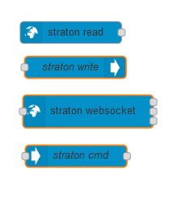
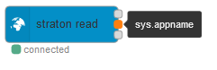
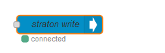
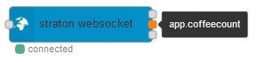

# Node-RED nodes for Straton Data-Server

This package **node-red-contrib-straton** contains nodes to easily connect to a Straton runtime data-server from [Straton Automation](https://straton-plc.com).

Using these nodes you can connect to a Straton runtime data-server to read and write application and system variables.

## Installation

Install using the managed palette from inside Node-RED.

### In Node-RED (preferred)

* Via **Manage Palette** -> **Search** for `node-red-contrib-ctrlx-automation`

### In a shell

* go to the Node-RED user data directory, e.g.: `~/.node-red`
* run `npm install node-red-contrib-ctrlx-automation --save`

## Usage - Quick Overview

### - Straton Read

Connect to a WebSocket and subscribe to one or several straton variables.

### - Straton Write

Connect to a WebSocket and write value of a straton variable.
Each time a message is coming in, the configured variable will be written

### - Straton Websocket

Connect to a WebSocket and subscribe to one or several straton variables.
Additionally, it can send other commands when a message is coming in.

There will be an output for each subscribed variable.
Each time the value of a variable is changed, a message with value will be sent on the corresponding output.

An additional output will send message with the result of the command sent 

### - Straton Command

Sends a data-server command to its output when receive a message.
This node should be used in conjunction with Straton Websocket.

## Documentation

Each node has it's own help/documentation available in the help window.

A more complete user guide is available [here](./docs/straton_user_guide_Node_Red_Rev2.pdf)

## Licenses

MIT License

Copyright (c) 2022 StratonAutomation

Permission is hereby granted, free of charge, to any person obtaining a copy
of this software and associated documentation files (the "Software"), to deal
in the Software without restriction, including without limitation the rights
to use, copy, modify, merge, publish, distribute, sublicense, and/or sell
copies of the Software, and to permit persons to whom the Software is
furnished to do so, subject to the following conditions:

The above copyright notice and this permission notice shall be included in all
copies or substantial portions of the Software.

THE SOFTWARE IS PROVIDED "AS IS", WITHOUT WARRANTY OF ANY KIND, EXPRESS OR
IMPLIED, INCLUDING BUT NOT LIMITED TO THE WARRANTIES OF MERCHANTABILITY,
FITNESS FOR A PARTICULAR PURPOSE AND NONINFRINGEMENT. IN NO EVENT SHALL THE
AUTHORS OR COPYRIGHT HOLDERS BE LIABLE FOR ANY CLAIM, DAMAGES OR OTHER
LIABILITY, WHETHER IN AN ACTION OF CONTRACT, TORT OR OTHERWISE, ARISING FROM,
OUT OF OR IN CONNECTION WITH THE SOFTWARE OR THE USE OR OTHER DEALINGS IN THE
SOFTWARE.

## About

Copyright © 2020-2022 Straton Automation. All rights reserved.

<https://straton-plc.com>

